Вот подробная схема прохождения трафика и описание настроек TRex.

**Ключевой момент архитектуры 1L-DSR с IPIP:** TRex выступает одновременно и как клиент (порт 0), и как "клиент, ожидающий прямой ответ" (порт 1). Ответный трафик от RealServer идёт напрямую на TRex, минуя балансировщик — это и есть Direct Server Return.---

## Схема прохождения трафика



### Прямой трафик (запрос клиента → RealServer)

**Шаг ①: TRex Port 0 → LB**

TRex генерирует UDP-пакет с обычным IP-заголовком:
- `src IP` = CLIENT_IP (виртуальный адрес клиента)
- `dst IP` = VIP (адрес балансировщика)
- `dst MAC` = MAC физического интерфейса LB (next-hop)

**Шаг ②: LB → RealServer (IPIP-инкапсуляция)**

LB оборачивает исходный пакет во внешний IP-заголовок:
- Внешний заголовок: `src IP` = LB_PHY_IP, `dst IP` = RS_PHY_IP
- Внутренний заголовок: `src IP` = CLIENT_IP, `dst IP` = VIP (оригинал без изменений)

**Шаг ③: RealServer декапсуляция**

RS снимает внешний IPIP-заголовок и видит `dst IP` = VIP. Поскольку VIP назначен на loopback RS, пакет принимается как локальный.

---

### Обратный трафик (DSR — минуя LB)

**Шаг ④: RealServer → TRex Port 1 напрямую**

RS отвечает напрямую клиенту, минуя балансировщик:
- `src IP` = VIP (RS отвечает от имени VIP, адрес которого у него на loopback)
- `dst IP` = CLIENT_IP
- `dst MAC` = MAC Port 1 TRex (next-hop для возврата)

**Шаг ⑤: TRex Port 1 принимает ответ**

Port 1 валидирует ответ: `src IP` должен совпадать с VIP, `dst IP` — с CLIENT_IP.

---

## Настройки TRex и их влияние на IP-адреса

### Конфигурация портов (`/etc/trex_cfg.yaml`)

```yaml
- port_limit: 2
  version: 2
  interfaces: ["eth0", "eth1"]   # Port 0 = eth0, Port 1 = eth1
  port_info:
    - ip: 192.168.10.10          # IP Port 0 — это CLIENT_IP
      default_gw: 10.0.0.254    # MAC этого GW → становится dst MAC пакетов с Port 0
                                  # то есть dst MAC = MAC физ. интерфейса LB
    - ip: 192.168.20.20          # IP Port 1 — этот адрес не должен совпадать с CLIENT_IP,
                                  # но именно на MAC этого интерфейса RS отправит ответы
      default_gw: 10.1.0.254    # GW для Port 1 — нужен для корректной ARP-резолюции,
                                  # но ответы приходят напрямую с RS
```

| Параметр | Что настраивает | На какой IP влияет |
|---|---|---|
| `port_info[0].ip` | IP Port 0 | Становится `src IP` в генерируемых запросах (CLIENT_IP) |
| `port_info[0].default_gw` | Next-hop для Port 0 | Определяет `dst MAC` в запросах → MAC интерфейса LB |
| `port_info[1].ip` | IP Port 1 | Адрес, на чей MAC приходят ответы от RS (RS знает этот MAC через ARP) |
| `port_info[1].default_gw` | Next-hop для Port 1 | Нужен для ARP/маршрутизации на этом сегменте |

### Профиль трафика (Python API или YAML)

```python
# Пример профиля STL
from trex_stl_lib.api import *

class STLS1(object):
    def create_stream(self):
        pkt = Ether(dst="AA:BB:CC:DD:EE:FF") / \  # dst MAC = MAC интерфейса LB
              IP(src="192.168.10.10",             / \  # CLIENT_IP → src IP запроса
                 dst="10.0.0.1")                  / \  # VIP → dst IP запроса
              UDP(sport=1234, dport=5000)          / \
              Raw(b'X' * 64)
        return STLStream(packet=STLPktBuilder(pkt=pkt),
                         mode=STLTXCont(pps=1000))
```

| Поле пакета | Параметр TRex | Роль в схеме |
|---|---|---|
| `Ether(dst=...)` | dst MAC в шаблоне пакета | MAC физического интерфейса LB — LB примет пакет |
| `IP(src=...)` | src IP в шаблоне | CLIENT_IP — на него RS отправит ответ |
| `IP(dst=...)` | dst IP в шаблоне | VIP — LB принимает и балансирует этот трафик |

### Ключевые особенности режима DSR для TRex

**Асимметричный маршрут** — запрос уходит через Port 0, ответ приходит на Port 1. TRex нужно запустить с флагом, разрешающим такую асимметрию:

```bash
./t-rex-64 -f profile.py -c 4 --astf   # для ASTF-режима
# или для STL с ручным управлением портами:
./t-rex-64 -f profile.py --no-flow-control-master
```

**ARP и MAC RealServer**: RS должен знать MAC Port 1 TRex, чтобы отправить ответ напрямую. Это решается либо статическим ARP на RS, либо тем, что Port 1 отвечает на ARP-запросы RS. Порт 1 в TRex должен быть в той же L2-сети, что и интерфейс RS (или между ними должен быть маршрутизатор, знающий CLIENT_IP).

**Валидация ответов**: TRex на Port 1 проверяет, что `src IP` входящих пакетов равен VIP — именно так подтверждается корректность DSR-пути.